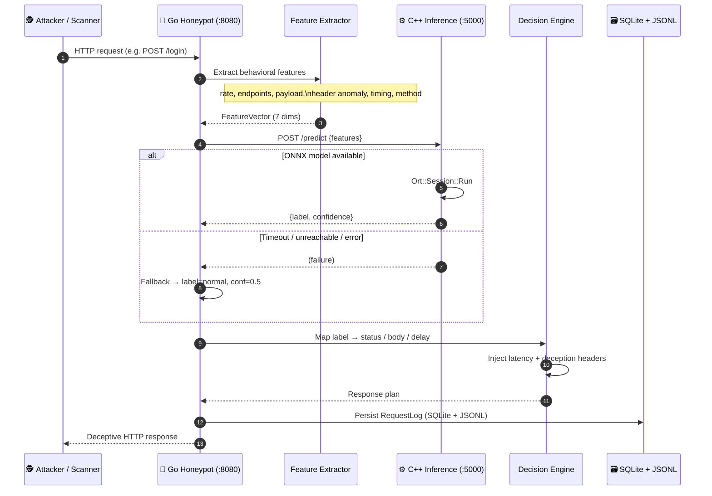

# =============================================================================
# 🛡️  API Honeypot System
# =============================================================================
#
# Production-grade API honeypot for security research and adversary profiling.
# Decoy REST endpoints extract behavioral features, classify threat level via a
# C++ ONNX inference service, then return deception-aware responses while
# dual-logging every interaction to SQLite + JSON Lines.
#
# =============================================================================

<p align="center">
  
  
  
  
  
</p>

<p align="center">
  <b>Go Honeypot API</b> · <b>C++ ONNX Inference</b> · <b>Adaptive Deception</b> · <b>SQLite + JSONL Telemetry</b>
</p>

---

## 📑 Table of Contents

- [Overview](#-overview)
- [Architecture & Request Lifecycle](#-architecture--request-lifecycle)
- [Threat Response Matrix](#-threat-response-matrix)
- [Repository Structure](#-repository-structure)
- [Prerequisites](#-prerequisites)
- [Setup Guides](#-setup-guides)
  - [Windows](#1-windows)
  - [Linux](#2-linux)
  - [Docker / Compose](#3-docker--containerized)
- [Model Export & Linking](#-model-export--linking)
- [Configuration](#-configuration)
- [Endpoint Reference](#-endpoint-reference)
- [Data Schema](#-data-schema)
- [Quick Verification](#-quick-verification)
- [Troubleshooting](#-troubleshooting)
- [Security Notes](#-security-notes)
- [Contributing](#-contributing)

---

## 🎯 Overview

| Capability | Detail |
|---|---|
| 🎭 **Decoy API surface** | Realistic `/login`, `/admin`, `/api/v1/*` endpoints for scanner engagement |
| 🧠 **ML-assisted classification** | Labels: `normal` · `suspicious` · `attack` via ONNX Random Forest |
| 🕸️ **Deception engine** | Fake errors, JWT baits, misleading headers, adaptive latency |
| 📦 **Dual telemetry** | SQLite (queryable) + JSON Lines (streamable) |
| ♻️ **Graceful fallback** | If C++ inference is down/timeout → safe default thresholds, honeypot stays up |

**Companion training repository:** [Network-Intrusion-Detection-Model](https://github.com/laila-kz/Network-Intrusion-Detection-Model)

---

## 🏗️ Architecture & Request Lifecycle



### ASCII flow (quick reference)

```text
 Attacker
    │  HTTP
    ▼
┌──────────────────────────────────────┐
│  Go Honeypot (honey_pot/)  :8080     │
│  • Decoy routes + catch-all 404      │
│  • Feature extraction                │
│  • ML client (timeout-aware)         │
│  • Decision / deception engine       │
│  • SQLite + JSONL logging            │
└──────────────────┬───────────────────┘
                   │ POST /predict
                   ▼
┌──────────────────────────────────────┐
│  C++ ML Service (ml-service/) :5000  │
│  • cpp-httplib HTTP surface          │
│  • ONNX Runtime inference            │
│  • Robust multi-shape output parse   │
└──────────────────────────────────────┘
```

---

## 📊 Threat Response Matrix

| Threat Level | Detection Criteria / Features | Response Action | Logging Behavior |
|---|---|---|---|
| 🟢 **normal** | Low request rate; common UA; balanced method mix; low header-anomaly score | **HTTP 200** · short jitter (`MIN_DELAY`–½`MAX_DELAY`) · realistic success JSON · `Server: nginx/1.18.0` | Full event to SQLite + JSONL · `ml_label=normal` |
| 🟡 **suspicious** | Elevated rate / unique endpoints; odd headers (`X-Forwarded-For` spoofing); tooling hints | **HTTP 200** · medium delay (`MIN`–`MAX`) · plausible success / fake JWT · **misleading headers**: `X-Debug-Path`, `X-Backend-Server`, `X-Powered-By` | Full event · label flagged for review |
| 🔴 **attack** | High anomaly score; scanner UAs (`sqlmap`, `nmap`, `nikto`); bursty probing | **HTTP 400/403/500/503** · long delay (`ATTACK_DELAY` + jitter) · fake SQL / pool-exhaustion errors · same misleading headers | Full event · console `[ATTACK DETECTED]` · priority triage |

> Fallback (ML unreachable): treated as **normal** with confidence `0.5` so the decoy surface never hard-fails.

---

## 📁 Repository Structure

```text
API-Honeypot-System/
├─ honey_pot/                    # 🐹 Go honeypot API
│  ├─ main.go
│  ├─ go.mod / go.sum
│  ├─ client/                    # ML HTTP client + fallback
│  ├─ config/                    # Env / .env configuration
│  ├─ decisions/                 # Deception + latency engine
│  ├─ feature/                   # Behavioral feature extraction
│  ├─ handlers/                  # Decoy endpoint handlers
│  ├─ logger/                    # SQLite + JSONL writers
│  └─ models/                    # Shared DTOs
├─ ml-service/                   # ⚙️ C++ ONNX inference
│  ├─ CMakeLists.txt
│  ├─ Dockerfile
│  ├─ build_windows.bat
│  ├─ models/                    # Place random_forest.onnx here
│  └─ src/
│     ├─ main.cpp
│     ├─ ONNXInference.{hpp,cpp}
│     └─ HTTPServer.{hpp,cpp}
├─ docker-compose.yml            # 🐳 One-command sandbox
├─ Dockerfile                    # Go honeypot image
├─ .env.example                  # Config template
└─ README.md
```

---

## ✅ Prerequisites

| Component | Windows | Linux | Notes |
|---|---|---|---|
| Go | 1.26+ | 1.26+ | CGO enabled (sqlite3) |
| CMake | 3.20+ | 3.20+ | |
| C++ toolchain | VS 2022 (Desktop C++) | g++ 9+ / clang | C++17 |
| vcpkg | Recommended | Recommended | `onnxruntime`, `nlohmann-json`, `spdlog` |
| Docker | Optional | Optional | Compose v2 |
| Python 3.10+ | Optional | Optional | Model export only |

---

## 🚀 Setup Guides

### 1) Windows

#### Step A — vcpkg dependencies

```powershell
cd C:\
git clone https://github.com/microsoft/vcpkg.git
cd vcpkg
.\bootstrap-vcpkg.bat
.\vcpkg integrate install

.\vcpkg install onnxruntime:x64-windows
.\vcpkg install nlohmann-json:x64-windows
.\vcpkg install spdlog:x64-windows
# optional: .\vcpkg install cpp-httplib:x64-windows
```

> `cpp-httplib` is auto-fetched by CMake via FetchContent if not installed.

#### Step B — Build C++ ML service

```powershell
cd <repo>\ml-service

cmake -B build -S . `
  -DCMAKE_TOOLCHAIN_FILE=C:/vcpkg/scripts/buildsystems/vcpkg.cmake `
  -DVCPKG_TARGET_TRIPLET=x64-windows `
  -DCMAKE_BUILD_TYPE=Release

cmake --build build --config Release
```

Binary: `ml-service\build\bin\Release\ml_service_cpp.exe`

Or run `.\build_windows.bat`.

#### Step C — Place ONNX model

```powershell
# After exporting from the training repo:
Copy-Item .\random_forest.onnx <repo>\ml-service\models\random_forest.onnx
```

#### Step D — Build & run Go honeypot

```powershell
cd <repo>\honey_pot
copy ..\.env.example .env   # optional
go mod tidy
go build -o honeypot.exe .

# Terminal A
cd <repo>\ml-service
.\build\bin\Release\ml_service_cpp.exe

# Terminal B
cd <repo>\honey_pot
.\honeypot.exe
```

---

### 2) Linux

#### Step A — vcpkg (or system packages)

```bash
git clone https://github.com/microsoft/vcpkg.git ~/vcpkg
~/vcpkg/bootstrap-vcpkg.sh

~/vcpkg/vcpkg install onnxruntime:x64-linux nlohmann-json:x64-linux spdlog:x64-linux
```

#### Step B — Build ML service

```bash
cd ml-service
cmake -B build -S . \
  -DCMAKE_TOOLCHAIN_FILE=$HOME/vcpkg/scripts/buildsystems/vcpkg.cmake \
  -DCMAKE_BUILD_TYPE=Release
cmake --build build --config Release -j"$(nproc)"
```

Binary: `ml-service/build/bin/ml_service_cpp`

#### Step C — Go honeypot

```bash
# Debian/Ubuntu need a C compiler for CGO sqlite
sudo apt-get install -y build-essential

cd honey_pot
cp ../.env.example .env
go mod tidy
go build -o honeypot .

# Terminal A
ONNX_MODEL_PATH=./models/random_forest.onnx ./build/bin/ml_service_cpp

# Terminal B
./honeypot
```

---

### 3) Docker / Containerized

```bash
# 1. Place model
cp /path/to/random_forest.onnx ml-service/models/random_forest.onnx

# 2. Launch both services
docker compose up --build

# Honeypot → http://localhost:8080
# ML       → http://localhost:5000/health
```

Logs persist in the `honeypot-logs` volume. Override ports via `.env`:

```bash
HONEYPOT_PORT=8080
ML_SERVICE_PORT=5000
```

---

## 🧬 Model Export & Linking

Train / export from: **https://github.com/laila-kz/Network-Intrusion-Detection-Model**

```bash
# Example export flow (inside the training repo)
python -m pip install numpy scikit-learn skl2onnx onnx onnxruntime

# After training your RandomForest (or equivalent):
python export_to_onnx.py \
  --model artifacts/random_forest.pkl \
  --output random_forest.onnx \
  --n-features 7
```

Link into this project:

```bash
# Linux / macOS
cp /path/to/random_forest.onnx ml-service/models/random_forest.onnx

# Windows PowerShell
Copy-Item C:\path\to\random_forest.onnx .\ml-service\models\random_forest.onnx
```

Runtime override (either OS):

```bash
export ONNX_MODEL_PATH=/abs/path/to/model.onnx          # Linux
$env:ONNX_MODEL_PATH = "C:\path\to\model.onnx"          # Windows
```

**Expected feature order (7 floats):**

1. `request_rate_per_ip`
2. `endpoint_frequency`
3. `unique_endpoints_per_ip`
4. `payload_size`
5. `header_anomaly_score`
6. `time_between_requests`
7. `method_distribution`

---

## ⚙️ Configuration

Copy `.env.example` → `.env` (repo root or `honey_pot/`). Environment variables always win over file values.

| Variable | Default | Description |
|---|---|---|
| `HONEYPOT_HOST` | `0.0.0.0` | Bind host |
| `HONEYPOT_PORT` | `8080` | Bind port |
| `HONEYPOT_ADDR` | — | Full `host:port` override |
| `ML_SERVICE_URL` | `http://localhost:5000/predict` | Inference endpoint |
| `LOG_DB_PATH` | `./logs/honeypot.db` | SQLite path |
| `LOG_JSON_PATH` | `./logs/requests.json` | JSONL path |
| `REQUEST_TIMEOUT_MS` | `5000` | ML HTTP timeout |
| `MIN_DELAY_MS` / `MAX_DELAY_MS` | `100` / `800` | Normal/suspicious jitter band |
| `ATTACK_DELAY_MS` | `2000` | Base attack delay |
| `FALLBACK_LABEL` | `normal` | Used when ML fails |
| `FALLBACK_CONFIDENCE` | `0.5` | Used when ML fails |
| `ML_SERVICE_PORT` | `5000` | C++ listen port |
| `ONNX_MODEL_PATH` | `models/random_forest.onnx` | Model file |

---

## 📡 Endpoint Reference

### Go Honeypot API (`:8080`)

| Method | Path | Purpose |
|---|---|---|
| `GET`/`POST` | `/login` | Decoy authentication |
| `GET`/`POST` | `/admin` | Decoy admin panel |
| `GET`/`POST` | `/api/v1/users` | Decoy user listing |
| `POST` | `/api/v1/auth` | Decoy token auth |
| `POST` | `/reset-password` | Decoy recovery flow |
| `GET` | `/dashboard` | Decoy metrics UI API |
| `GET` | `/logs?ip=<addr>` | Operator: recent events by IP |
| `*` | `/*` | Decoy `404` + still classified/logged |

### C++ ML Service (`:5000`)

| Method | Path | Purpose |
|---|---|---|
| `POST` | `/predict` | Inference on feature vector |
| `GET` | `/health` | Liveness + `model_loaded` |
| `GET` | `/` | Service metadata |

#### Predict request / response

```json
// POST /predict
{
  "features": {
    "request_rate_per_ip": 0.12,
    "endpoint_frequency": 0.04,
    "unique_endpoints_per_ip": 0.3,
    "payload_size": 0.01,
    "header_anomaly_score": 0.8,
    "time_between_requests": 0.05,
    "method_distribution": 0.0
  }
}
```

```json
// 200 OK
{ "label": "attack", "confidence": 0.91 }
```

---

## 🗃️ Data Schema

### SQLite — `requests`

| Column | Type | Notes |
|---|---|---|
| `id` | `TEXT` PK | UUID |
| `timestamp` | `DATETIME` | UTC ISO-8601 |
| `ip` | `TEXT` | Client IP (honors `X-Forwarded-For`) |
| `user_agent` | `TEXT` | |
| `method` | `TEXT` | |
| `endpoint` | `TEXT` | URL path |
| `headers` | `TEXT` | JSON; secrets redacted |
| `body` | `TEXT` | Capped at 1 MiB |
| `response_code` | `INTEGER` | |
| `response_time` | `INTEGER` | Milliseconds |
| `ml_label` | `TEXT` | `normal` / `suspicious` / `attack` |
| `confidence` | `REAL` | `0.0`–`1.0` |

Indexes: `ip`, `ml_label`, `timestamp`.

### JSON Lines — `requests.json`

```json
{
  "id": "550e8400-e29b-41d4-a716-446655440000",
  "timestamp": "2026-09-25T07:42:10.123Z",
  "ip": "203.0.113.50:51234",
  "user_agent": "sqlmap/1.7",
  "method": "POST",
  "endpoint": "/login",
  "headers": {
    "Content-Type": "application/json",
    "Authorization": "[REDACTED]"
  },
  "body": "{\"username\":\"admin\",\"password\":\"' OR 1=1--\"}",
  "response_code": 500,
  "response_time_ms": 2410,
  "ml_label": "attack",
  "confidence": 0.93
}
```

---

## 🧪 Quick Verification

```bash
# ML health
curl http://localhost:5000/health

# Benign traffic
curl http://localhost:8080/api/v1/users

# Attack-like probe
curl -X POST http://localhost:8080/login \
  -H "User-Agent: sqlmap" \
  -H "Content-Type: application/json" \
  -d '{"test":1}'

# Burst (suspicious)
for i in $(seq 1 10); do curl -s http://localhost:8080/admin >/dev/null; done
```

```powershell
# Windows burst
1..10 | ForEach-Object { curl.exe -s http://localhost:8080/admin > $null }
```

---

## 🔧 Troubleshooting

### ❌ Model shape mismatch / ONNX crash

**Symptom:** ML service logs `Ort::Exception`, empty outputs, or wrong labels.

**Cause:** Exported model output rank/type differs (e.g. int64 labels vs float probs, `[1,3]` vs `[3]`).

**Fix:**
1. On startup the service prints input/output shapes — compare with your export.
2. `ONNXInference` now prefers float probability tensors, handles int64 label heads, pads/truncates feature dims to the model’s expected width, and falls back to `{normal, 0.5}` instead of aborting.
3. Re-export with **exactly 7 input features** in the order listed above.
4. Rebuild: `cmake --build build --config Release`.

### ❌ Port collision (`:5000` / `:8080`)

```powershell
# Windows
netstat -ano | findstr ":5000"
netstat -ano | findstr ":8080"
# Stop the PID or override:
$env:ML_SERVICE_PORT = "5001"
$env:HONEYPOT_PORT = "8081"
$env:ML_SERVICE_URL = "http://localhost:5001/predict"
```

```bash
# Linux
ss -ltnp | grep -E ':5000|:8080'
ML_SERVICE_PORT=5001 HONEYPOT_PORT=8081 \
  ML_SERVICE_URL=http://localhost:5001/predict ./honeypot
```

### ❌ Go fallback when C++ inference is unreachable

**Symptom:** Logs show `[ml-client] inference unreachable ... using fallback`.

**Behavior (by design):**
- HTTP client respects `REQUEST_TIMEOUT_MS` (default 5s).
- On timeout, dial error, non-2xx, or decode failure → `FALLBACK_LABEL` / `FALLBACK_CONFIDENCE`.
- Honeypot **keeps serving** decoy responses; only classification quality degrades.

**Checklist:**
1. `curl http://localhost:5000/health` → `model_loaded: true`
2. `ML_SERVICE_URL` matches the ML listen address (use service DNS `http://ml-service:5000/predict` in Docker).
3. Firewall / container network allows Go → ML.

### ❌ Missing `random_forest.onnx`

```text
[Main] Failed to initialize ONNX model!
```

Place the file under `ml-service/models/` or set `ONNX_MODEL_PATH`.

### ❌ CGO / sqlite build errors on Linux

```bash
sudo apt-get install -y build-essential
CGO_ENABLED=1 go build -o honeypot .
```

---

## 🔒 Security Notes

- 🔬 Research / education honeypot — **not** a production auth service.
- All success payloads, JWTs, and SQL errors are **intentionally fabricated**.
- `Authorization`, `Cookie`, and `X-Api-Key` headers are redacted in logs.
- Deploy on an isolated VLAN, VM, or container network — never in front of crown-jewel assets.
- Comply with local law; only expose to traffic you are authorized to observe.

---

## 🗺️ Roadmap

- Richer per-endpoint deception templates
- Session / IP behavioral scoring across windows
- Operator dashboard for live telemetry
- Pluggable threat-intel enrichment
- Expanded feature set + calibration pipeline

---

## 🤝 Contributing

PRs welcome for research and educational improvements.

1. Fork → feature branch
2. Include reproducible validation steps / threat-model notes
3. Open a PR with clear rationale

```text
MIT License — see LICENSE (or repository settings) for details.
```

<p align="center">
  <sub>Built for defenders who study attackers. Stay curious. Stay isolated.</sub>
</p>
